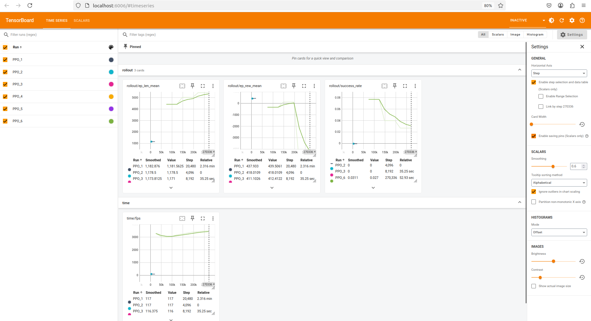
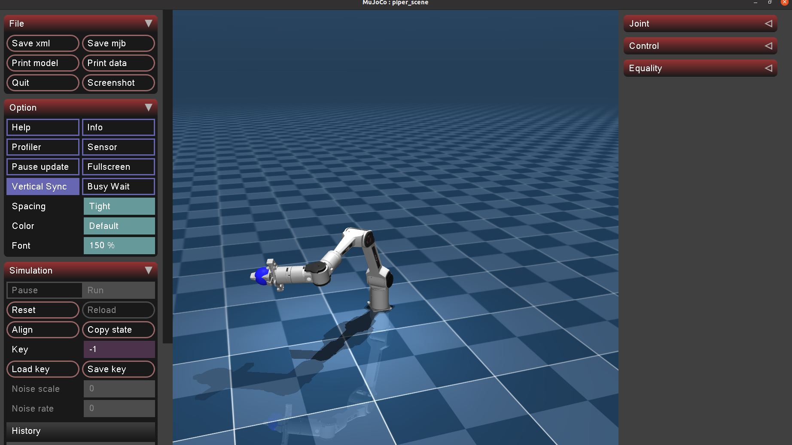
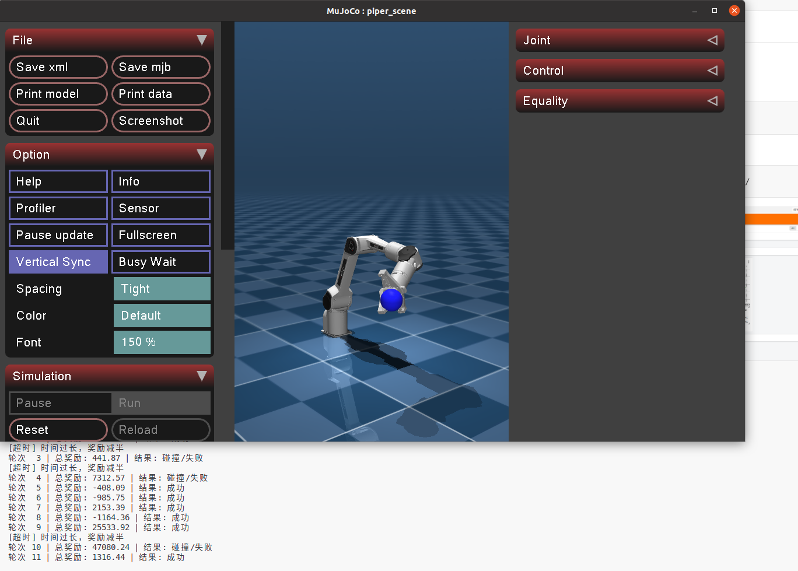

# Piper RL Demo

使用 MuJoCo 和 PPO 训练 PiPER 机械臂完成 Reach Target 任务：夹爪中心到达指定位置，不约束末端姿态。

## 环境

在项目目录下运行：

```bash
conda activate piper
python -m pip install -r requirements.txt
```

## 目录

- `piper_rl_mujoco.py`：PPO 训练和策略测试入口。
- `camera_demo.py`：相机与基座运动演示入口。
- `config/settings.json`：唯一运行配置与默认参数；`config/cli.py`：全部命令行解析。
- `config/vision/`：D435i 视觉模块和视觉依赖。
- `config/imu/`：[D435i IMU](config/imu/README.md) 角速度、加速度处理和仿真/真实设备入口。
- `config/flobase/`：浮动基座控制模块和轨迹配置。
- `config/doc/`、`config/tests/`、`config/scripts/`：说明、测试和辅助启动脚本。
- `xml/agilex/`：机械臂模型与网格资源。
- `xml/parts/`：D435i 相机和视觉目标 XML 配置。
- `models/`：策略模型；附带 `piper_ppo_reach_target.zip`。
- `doc/`：MuJoCo 演示图片。
- `tensorboard/`：训练日志。

## 相机和浮动基座

两个入口每次启动/reset 都从 `source/sample_init_poses.csv` 随机读取六轴角度，
并在相机前方 0.2–2.8 m 的平面上生成直径 15 mm 的 marker，默认 6 个球。
`episode.markers.marker_fovy=[30,30]` 单独限制生成范围（水平/垂直角，单位度），
不改变 D435i 的 RGB 1280×720、深度 848×480 成像或标定。全部配置在 `config/settings.json`。
数量、位置函数、基座文件轨迹/位姿函数/速度函数及 RL reset 接口见
[初始化与运动配置](config/doc/episode_init.md)。窗口按 R 可重新采样。

原背景与地板保留；全部 CSV 姿态的基座初始高度统一为 4 m。外部窗口显示
淡蓝透明 marker 平面，相机提供球心估计和跨帧编号。
完整函数输入、输出和算法原理见 [改动与函数说明](config/doc/simulation_functions.md)。

详细参数与接口见 [D435i 视觉说明](config/doc/d435i_vision.md) 和
[浮动基座说明](config/doc/floating_base.md)。
硬件参数、修正内容和未建模功能见 [D435i 硬件一致性审查](config/doc/d435i_hardware_audit.md)。

```bash
python camera_demo.py --headless --frames 1
python camera_demo.py --base-motion config/flobase/base_motion.json --frames 150
python camera_demo.py --headless --frames 1 --base-pos 0.1 0 0.2 --base-rpy 0 0 0.3
```

相机参数位于 `config/settings.json` 的 `vision` 节，相机输出保存在 `config/outputs/vision/`。
Python 接口从 `config.flobase.piper_base` 和 `config.vision.piper_vision` 导入。

## 验证

```bash
python -m unittest discover -s config/tests -v
python -m pip check
```

## 仓库

[Piper_rl](https://github.com/vanstrong12138/Piper_rl.git)
[Agilex-College](https://github.com/agilexrobotics/Agilex-College.git)

## Mujoco示例

### 在mujoco中实现多个piper并行训练

通过命令行指定训练模式、环境数量和配置：
```bash
python piper_rl_mujoco.py --mode train --n-envs 12 --config config/settings.json
```

开启tensorboard可以看见训练过程中多个piper的奖励变化
```bash
tensorboard  --logdir tensorboard/piper_reach_target/
```


### 在mujoco中测试训练好的模型

通过 `--mode test` 和 `--model-path` 指定测试模式及模型。
测试模式默认使用附带的 `models/piper_ppo_reach_target.zip`；训练模式保存到
`models/piper_train_reach_target.zip`。然后运行：
```bash
python piper_rl_mujoco.py --mode test --episodes 15
```

可以看到piper成功到达目标位置




## 参考

[https://github.com/LitchiCheng/mujoco-learning](https://github.com/LitchiCheng/mujoco-learning)
