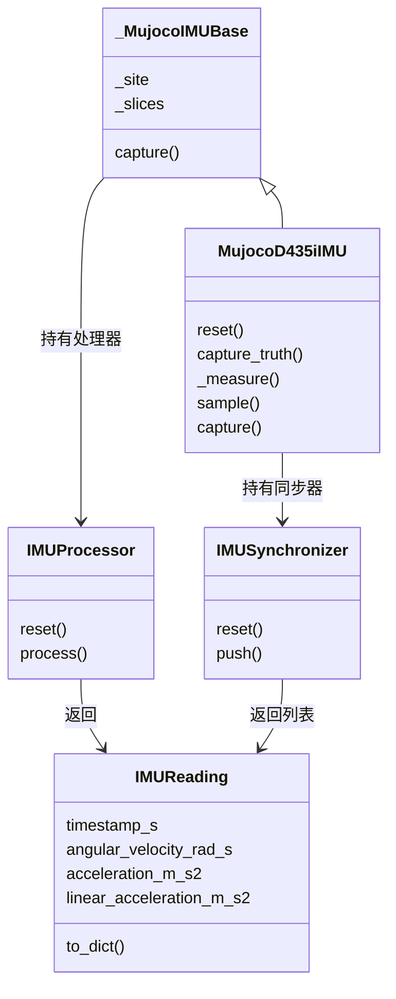
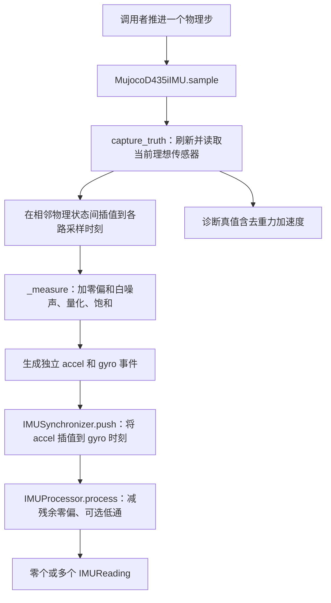

# PiPER IMU 源码说明：传感器读数、异步采样与数据处理

本文分析 [`piper_imu.py`](../imu/piper_imu.py) 与 [`simulation.py`](../imu/simulation.py) 的当前实现，解释各个类、函数及调用关系，并结合 PiPER 末端 D435i 的安装方式说明数据的物理意义。文中“已实现”以源码为依据，理论推导和扩展建议单独说明。

先把握两份文件的分工：`piper_imu.py` 定义数据和处理规则，包括校验、同步、零偏校正、滤波与重力处理；`simulation.py` 利用这些规则，把 MuJoCo 的理想读数转成具有独立采样时钟、噪声、量化和量程限制的 IMU 观测。

这里的 IMU 输出是角速度和加速度计比力。它没有自动生成姿态、速度或位置，也没有与 RGB-D 做状态融合。

## 阅读导航

1. [项目位置与两份文件的调用关系](#1-项目位置与两份文件的调用关系)
2. [先理解传感器测量的物理量](#2-先理解传感器测量的物理量)
3. [piper_imu.py：数据与处理基础](#3-piper_imupy数据与处理基础)
4. [simulation.py：从真值到仿真观测](#4-simulationpy从真值到仿真观测)
5. [用时间线理解两次插值和批量输出](#5-用时间线理解两次插值和批量输出)
6. [配置与最小运行示例](#6-配置与最小运行示例)
7. [与机械臂、视觉和真实设备的关系](#7-与机械臂视觉和真实设备的关系)
8. [实现边界、验证与扩展方向](#8-实现边界验证与扩展方向)

## 1. 项目位置与两份文件的调用关系

### 1.1 相关文件

| 文件 | 主要作用 |
| --- | --- |
| [`piper_imu.py`](../imu/piper_imu.py) | 数据结构、校验、零偏估计、低通、同步，以及理想 MuJoCo 传感器读取基类 |
| [`simulation.py`](../imu/simulation.py) | 型号配置、独立采样时钟、误差模型、同步观测输出 |
| [`settings.json`](../settings.json) 的 `imu` 节 | 配置仿真型号、速率、误差开关和附加零偏 |
| [`imu/__init__.py`](../imu/__init__.py) | 导出 `IMUProcessor`、`MujocoD435iIMU` 等公共接口 |
| [`imu/__main__.py`](../imu/__main__.py) | `python -m config.imu` 命令行入口 |
| [`realsense_imu.py`](../imu/realsense_imu.py) | 从 SDK 获取真实异步事件，复用同步器和处理器 |
| [`config/d435i.py`](../d435i.py) | 加载并应用相机与 IMU 的内部几何标定 |
| [`xml/parts/d435i.xml`](../../xml/parts/d435i.xml) | 定义末端安装体和 `d435i_imu_site` 的位置、方向 |
| [`xml/agilex/piper.xml`](../../xml/agilex/piper.xml) | 在 IMU site 上定义 `gyro` 和 `accelerometer` |
| [`camera_demo.py`](../../camera_demo.py) | 每个物理步采样 IMU，同时按视觉帧率采集图像 |
| [`piper_rl_mujoco.py`](../../piper_rl_mujoco.py) | 将新 IMU 样本通过环境接口暴露给调用者 |

### 1.2 继承与组合关系

`simulation.py` 中有一条重要导入：

```python
from .piper_imu import _MujocoIMUBase as _TruthSensor, IMUSynchronizer, _vector
```

`_TruthSensor` 只是 `_MujocoIMUBase` 的本地别名，并不是新的传感器类。



继承用于复用传感器定位和处理器初始化；同步器与处理器则是独立对象，由仿真类组织调用。`piper_imu.py` 不反向导入 `simulation.py`。

### 1.3 正常采样的调用链



正常 `sample()` 只从真值对象取出角速度和比力参与测量生成，最终调用处理器时**不传入真值姿态**，所以普通仿真观测的 `linear_acceleration_m_s2` 为 `None`。

另外，子类的 `capture()` 覆盖了基类同名方法。对 `MujocoD435iIMU` 调用 `capture()`，走的是 `sample()` 路径，不会自动执行基类的 `capture()`。

## 2. 先理解传感器测量的物理量

### 2.1 陀螺仪：局部坐标中的角速度

`angular_velocity_rad_s` 为三维角速度向量，单位 rad/s，正方向遵循右手规则。它描述传感器随刚体转动的瞬时角速度，不能直接当作 roll、pitch、yaw 三个欧拉角各自的变化率。

本模块采用 IMU 光学坐标：X 向右、Y 向下、Z 向前。这是随传感器一起转动的局部参考系；机械臂转动后，同一世界向量在该坐标系中的分量会改变。SDK 的 D435i 文档也使用此轴向约定。[RealSense IMU 坐标说明](https://github.com/realsenseai/librealsense/blob/master/doc/d435i.md)

### 2.2 加速度计：为什么静止时不为零

加速度计测量的是比力（specific force）。定义：

- $R_{WI}$：把 IMU 局部向量变换到世界系的旋转矩阵；
- $a_W$：IMU 所在点的物理线加速度；
- $g_W$：世界重力向量；
- $f_I$：理想加速度计比力。

则：

$$
f_I=R_{WI}^{T}(a_W-g_W)
$$

静止在支架上的 IMU 满足 $a_W=0$，因此读数为 $-R_{WI}^{T}g_W$。直观上，支架阻止了自由落体，加速度计测到了这种支撑作用。

在镜头水平朝前、局部 Y 轴向下的例子中，$g_I=(0,+9.80665,0)$ m/s²，所以静止比力约为 $(0,-9.80665,0)$ m/s²。此例的姿态条件不可省略：PiPER 末端朝向改变，重力会投影到其他轴上。[RealSense 静止读数解释](https://github.com/realsenseai/librealsense/blob/master/doc/d435i.md)

| 运动状态 | 物理加速度 $a_W$ | 理想比力 $f_I$ |
| --- | --- | --- |
| 固定在支架上静止 | 0 | $-R_{WI}^{T}g_W$ |
| 理想自由落体 | $g_W$ | 0 |
| 任意运动 | 由运动决定 | $R_{WI}^{T}(a_W-g_W)$ |

因此，字段名 `acceleration_m_s2` 虽然叫“加速度”，其数据契约是比力，不能直接做两次积分来恢复位移。

### 2.3 去重力需要同一时刻的姿态

从比力恢复物理线加速度，在 IMU 轴下为：

$$
a_I=f_I+R_{WI}^{T}g_W
$$

如果还需要世界系加速度，再计算 $a_W=R_{WI}a_I$。程序的 `remove_gravity()` 只执行第一步，输出仍在 IMU 局部轴下。

单帧六轴数据不能直接提供唯一的绝对姿态。静止时可以利用重力约束倾斜方向，但重力不提供航向约束；动态比力又混有运动加速度。因此代码要求调用者提供外部姿态，没有内置姿态估计器。

## 3. piper_imu.py：数据与处理基础

此文件包含 4 个模块级函数和 4 个类，下面按数据进入处理链的顺序解释。

### 3.1 `_vector(value, name)` 与 `_rotation(value)`

| 函数 | 校验内容 | 返回值 |
| --- | --- | --- |
| `_vector()` | 转为浮点数组，必须恰为 `(3,)` 且全部有限 | 三维向量副本；异常信息带 `name` |
| `_rotation()` | 必须为有限 `3×3`，满足 $R^TR\approx I$、$\det R\approx1$ | 校验后的浮点矩阵 |

旋转校验同时检查正交性和行列式，可以排除轴反射等不合法变换。正交矩阵的逆等于转置，后续才能使用 `R.T` 做世界向量到局部坐标的转换。

`_rotation()` 接收的是旋转矩阵，不是 `4×4` 齐次变换。它不像 `_vector()` 那样保证复制输入，调用者应避免在使用期间修改共享矩阵。

### 3.2 `remove_gravity(...)`

输入依次为比力、光学系到世界系的旋转，以及可选重力向量。默认重力是 `(0, 0, -9.80665)` m/s²，函数校验输入后直接实现 $a_I=f_I+R^Tg_W$。

旋转矩阵和比力必须对应同一采样时刻。不能用当前末端姿态去修正缓冲区里较早的 IMU 样本，也不能假设重力始终沿传感器 Z 轴。仿真真值接口会传入 `model.opt.gravity`，所以它不一定使用默认的 9.80665。

### 3.3 `estimate_stationary_bias(...)`：已知静止区间的残余零偏

该函数接收 gyro、accel 两组 `N×3` 样本和该姿态的预期比力。每组至少 20 个有限样本；两组数量可以不同，并不要求先按时间配对，因为这里分别估计均值。

默认逐轴标准差上限为 gyro 0.02 rad/s、accel 0.15 m/s²。函数使用 `values.std(axis=0)` 检查窗口是否波动过大，再返回：

$$
\hat b_\omega=\operatorname{mean}(\omega),\qquad
\hat b_f=\operatorname{mean}(f)-f_{expected}
$$

例如静止时预期比力为 `[0, -9.80665, 0]`，均值却为 `[0.1, -9.70665, 0.2]`，估计的 accel 零偏为 `[0.1, 0.1, 0.2]`。这样只减去残余偏差，不会把重力响应一并消掉。

**低方差不等于已证明静止。** 恒定角速度或恒定加速度也可能产生稳定读数。已知静止是调用前提；该函数不会自动寻找静止区间，也不估计比例因子、轴间耦合或完整多姿态标定。返回值需要显式交给 `IMUProcessor`，不会自动更新任何对象。

### 3.4 `IMUReading` 与 `to_dict()`：统一输出格式

`IMUReading` 是 `@dataclass`，没有自定义采样逻辑。两路同步数据、处理结果和诊断真值都使用它，因此要结合调用来源理解字段。

| 字段 | 含义 |
| --- | --- |
| `timestamp_s` | 测量时间，秒；同步结果使用 gyro 的采样时刻 |
| `angular_velocity_rad_s` | 三轴角速度，rad/s |
| `acceleration_m_s2` | 三轴比力，m/s²；可能已经过校正、插值或滤波 |
| `timestamp_domain` | 默认 `hardware_clock`，仿真明确写为 `simulation` |
| `frame_id` | 默认 `d435i_imu_optical`，参考原点为 IMU |
| `linear_acceleration_m_s2` | 可选的去重力线加速度，仍在局部轴下；缺少姿态时为 `None` |

`to_dict()` 将向量变成 Python 列表，保留时间、时钟域、参考系和可选字段，便于 JSON 序列化；它不改单位，也不进行额外校验。`IMUReading` 本身没有冻结数组或强制验证类型，业务代码应避免修改共享读数。

### 3.5 `IMUProcessor`：校正与可选低通

#### `__init__(gyro_bias, accel_bias, cutoff_hz, reset_gap_s)`

初始化两组待扣除的残余零偏，校验截止频率和间断阈值。默认零偏为零、`cutoff_hz=None`，即不启用低通；默认 `reset_gap_s=0.5` 秒。

这些 bias 是处理器要**减掉**的校正量，与仿真器要**加上**的误差参数作用相反。SDK motion 数据进入该处理层时已经是 SI 单位，不应再按芯片原始寄存器比例转换。[SDK IMU 数据与标定说明](https://github.com/realsenseai/librealsense/blob/master/doc/d435i.md)

#### `reset()`

清空上一次时间、时钟域与滤波结果，不修改零偏或截止频率。重启数据流、切换时钟域或修改校正参数后，需要重置状态。

#### `process(...)`

按顺序执行：

1. 校验时间有限；后续时间必须严格递增，并且时钟域不变。
2. 校验向量并扣除 gyro、accel 残余零偏，组合成 `2×3` 数组。
3. 若有历史、启用低通且间隔不超过 `reset_gap_s`，更新一阶滤波结果。
4. 若传入 `world_from_optical`，对处理后的比力调用 `remove_gravity()`。
5. 保存状态副本，并返回新的 `IMUReading`。

低通公式为：

$$
\alpha=1-e^{-2\pi f_c\Delta t},\qquad
y_k=y_{k-1}+\alpha(x_k-y_{k-1})
$$

这与一阶系统在区间内输入保持不变时的指数响应一致。代码用 `-np.expm1(-2*pi*fc*dt)` 计算系数，改善指数接近 1 时直接相减的数值精度。

截止频率越低，结果通常越平滑，但响应越慢。这里使用实际时间间隔，不假定所有输入都严格等间隔；首次输入及间隔超过 0.5 秒的输入直接成为新的滤波状态。长间断仅跳过旧滤波值，并不允许时间倒退或改变时钟域。

滤波在局部轴下进行，且发生在去重力之前。快速转动时，历史比力包含历史姿态的重力投影，滤波后再减去当前重力可能留下动态残差；这条处理链不等价于完整的姿态融合或运动补偿。

### 3.6 `IMUSynchronizer`：将 accel 对齐到 gyro 时间

#### `__init__(max_gap_s=0.1, capacity=4096)` 与 `reset()`

初始化最大允许加速度插值间隔和每路缓冲容量。`reset()` 清空 accel/gyro 两个 `deque`、各流最后时间、公共时钟域以及 `dropped_gyro` 计数。

#### `push(stream, timestamp_s, xyz, timestamp_domain)`

每次接收一个 `accel` 或 `gyro` 事件，返回零个或多个同步 `IMUReading`。它允许不同流的事件交错到达，但要求每一路内部的时间严格递增，并要求所有事件属于同一时钟域。

对待输出的 gyro 时刻 $t_g$，寻找加速度样本 $(t_0,f_0)$、$(t_1,f_1)$，满足 $t_0\leq t_g\leq t_1$，计算：

$$
\lambda=\frac{t_g-t_0}{t_1-t_0},\qquad
f(t_g)=(1-\lambda)f_0+\lambda f_1
$$

输出保留原 gyro 向量和时间，把插值后的 accel 与它配成一组。这种同步不生成更高频的独立 accel 测量：多个输出可能来自同一对 accel 样本，误差也会相关。

| 缓冲情况 | 处理方式 |
| --- | --- |
| 少于两个 accel 样本 | 等待，即使某个 gyro 与唯一 accel 时间相同 |
| gyro 早于保留的最早 accel | 丢弃 gyro，增加计数 |
| gyro 晚于当前最后可用 accel | 等待后续 accel，不外推 |
| 可以用相邻 accel 夹住 gyro | 插值后输出 |
| 夹住 gyro 的 accel 间隔超过 `max_gap_s` | 丢弃该 gyro，不跨越大缺口插值 |
| 某路缓冲超过容量 | 移除该路最旧样本；移除 gyro 时直接增加丢弃计数 |

为了推进窗口，函数会丢掉已不需要的旧 accel，保留可用于后续插值的历史。被移除的 accel 本身不计入 `dropped_gyro`，但因此无法再配对的旧 gyro 后续会被计入。流停止后，缺少后置 accel 的尾部 gyro 不会自动外推或冲刷输出。

### 3.7 `_MujocoIMUBase`：定位并读取理想传感器

#### `__init__(model, processor=None)`

定位 `d435i_imu_site`，查找 `d435i_gyro`、`d435i_accel`，分别验证传感器类型、绑定 site 和输出维数为 3，再根据 `sensor.adr` 记录 `data.sensordata` 中的切片。这样不会假设 IMU 总是占据数组最前面的六个元素。

基类接收外部处理器；没有传入时创建默认 `IMUProcessor()`。MuJoCo 在 site 的局部坐标中提供这两类传感器读数，site 决定测量点和坐标轴。[MuJoCo 传感器定义](https://mujoco.readthedocs.io/en/3.3.2/XMLreference.html#sensor-accelerometer)

#### `capture(data)`

调用 `mj_forward()` 刷新当前状态对应的传感器值，复制两个切片，然后调用处理器，传入仿真时间、`simulation` 时钟域、site 世界旋转和模型重力。

基类路径没有独立硬件节奏，也没有仿真器的噪声、量化和饱和；它会使用处理器状态并提供去重力结果。连续以相同时间调用会触发处理器的时间检查。正常业务应通过子类 `sample()` 获取观测，用子类 `capture_truth()` 获取独立诊断真值。

## 4. simulation.py：从真值到仿真观测

此文件包含 `PROFILES` 常量、一个模块级 `load_imu_config()` 函数和 `MujocoD435iIMU` 类；类内自定义 6 个方法。

### 4.1 `PROFILES` 与 `load_imu_config(path=None)`

`PROFILES` 记录当前实现支持的两个配置：

| 型号 | 支持的 accel 速率 | accel 位数 | accel 噪声密度近似 |
| --- | --- | --- | --- |
| BMI055 | 62.5、250 Hz | 12 bit | 150 µg/√Hz |
| BMI085 | 100、200 Hz | 16 bit | 135 µg/√Hz |

两者 gyro 均支持 200/400 Hz，仿真中采用 16 bit。表格表达当前代码的配置范围，不是芯片所有寄存器模式的列表，也不能凭这些值识别实际相机内部型号。

`load_imu_config(value=None)` 从统一 `config/settings.json` 加载 `imu` 节，支持统一 JSON 路径或节字典递归覆盖；路径按项目根目录解释。型号和速率校验仍在仿真类初始化中完成。

### 4.2 `MujocoD435iIMU.__init__()`：建立型号和采样约束

初始化依次执行：

1. 加载默认配置，或对传入字典做浅复制。
2. 检查型号及 gyro/accel 速率是否受支持，保存到 `_rates`。
3. 校验要注入的两组零偏，保存到 `_bias`。
4. 设置 `_range`、`_bits`、`_density`：gyro 量程 ±1000°/s，accel 量程 ±4g，内部全部换算到 SI 单位。
5. 要求 `model.opt.timestep` 不大于最快传感器周期，避免在跨度过大的物理状态之间伪造高频测量。
6. 若指定 `calibration_path`，加载并应用内部几何标定；这会修改传入模型的相关相机/site 参数。
7. 调用 `super().__init__()` 定位传感器并准备处理器。
8. 创建 `IMUSynchronizer()`，随后调用子类 `reset()`。

默认最快通道是 400 Hz gyro，其周期为 2.5 ms，因此 2 ms 物理步满足要求。满足步长限制只保证实现允许采样，不保证任意高频运动或碰撞瞬态都被准确重建。

指定的标定文件主要控制设备内部几何；它不会自动把文件中的其他标定信息转换成 `IMUProcessor` 的残余零偏。未指定路径时，本类使用模型当前 site 几何，项目入口也可能已通过共享标定设置过它。

### 4.3 `reset(seed=None)`：同时清理四类状态

该方法重建随机数生成器，重置处理器和同步器，并清空上一次真值、采样起点、两路事件计数以及 `last_motion_samples`。

它同步重置了随机状态、滤波状态、异步缓冲和采样时钟，但不会重置 MuJoCo 物理状态或重新加载配置。相同种子、相同状态和事件调用顺序可复现噪声；两路共用一个随机数生成器，改变某路速率会改变随机数消费顺序。

### 4.4 `capture_truth(data)`：不经过观测误差的诊断入口

调用 `mj_forward()`，从基类记录的切片读取理想 gyro 和 accel，再用 site 当前世界旋转与 `model.opt.gravity` 计算去重力加速度，返回 `IMUReading`。

它不调用 `self.processor.process()`，因此不扣除残余零偏，不滤波，也不修改处理器、同步器或随机数状态。它会刷新 MuJoCo 的派生状态，但不推进仿真时间。

此方法可用于对照分析和误差评估，不宜把它提供的真值去重力加速度误认为真实硬件可直接观测的量。

### 4.5 `_measure(stream, truth)`：构造测量误差

处理顺序是 **理想值 + 附加零偏 → 可选白噪声 → 可选量化 → 饱和裁剪**。三轴采用相同的该流参数，函数返回一个三维 SI 向量。

#### A. 注入常值零偏

$$
x_b=x_{truth}+b_{sim}
$$

`gyro_bias_rad_s`、`accel_bias_m_s2` 是仿真测量要带有的附加偏差。默认均为零，并不代表所有真实设备的残余零偏都为零。

仿真偏差与处理器校正的关系为：

$$
x_{processed}\approx x_{truth}+b_{sim}-b_{processor}+n
$$

因此，只有显式把相应估计量传给处理器，才会扣除偏差；两处配置不会自动绑定。量化和饱和发生后，简单相减也无法完全恢复原始值。

#### B. 从噪声密度得到每个样本的白噪声

代码采用：

$$
\sigma=N\sqrt{f_s/2},\qquad n\sim\mathcal N(0,\sigma^2)
$$

其中 $N$ 为噪声密度，$f_s$ 为该通道原始采样率。这来自白噪声功率谱在等效带宽 $B$ 上的积分关系 $\sigma^2=N^2B$，本实现近似取 $B=f_s/2$。

gyro 密度取 0.014°/s/√Hz；BMI085 accel 使用 135 µg/√Hz。Bosch 数据表把 135 标为 accel Z 轴典型值，X/Y 典型值为 105；本实现把较大的值统一用于光学坐标三轴，是简化模型，并非完整的芯片轴噪声变换或实测设备拟合。[Bosch BMI085 数据表](https://www.bosch-sensortec.com/media/boschsensortec/downloads/datasheets/bst-bmi085-ds001.pdf)

默认配置下，模型推导的原始噪声标准差约为：

- gyro 400 Hz：$0.014\sqrt{200}\approx0.198$ °/s，即 0.00346 rad/s；
- accel 200 Hz：$135\times10^{-6}\times9.80665\times\sqrt{100}\approx0.01324$ m/s²。

这些是同步插值和可选软件低通之前的噪声估算，不是最终输出标准差。插值会改变噪声幅度和相关性；真实设备的有效带宽也可能受内部数字滤波限制，不能仅凭输出速率决定。

#### C. 量化与饱和

设正向量程参数为 $L$、位数为 $n$，量化步长为：

$$
q=\frac{2L}{2^n},\qquad x_q=q\operatorname{round}(x/q)
$$

随后执行 `np.clip(value, -limit, limit-step)`。上限为 $L-q$，对应从 $-L$ 开始、间隔为 $q$ 的 $2^n$ 个表示等级。

| 通道 | 仿真步长 |
| --- | --- |
| gyro，±1000°/s、16 bit | 约 0.03052°/s，即 0.000533 rad/s |
| BMI055 accel，±4g、12 bit | 约 0.01915 m/s² |
| BMI085 accel，±4g、16 bit | 约 0.001197 m/s² |

即使 `quantization_enabled=False`，最终饱和裁剪仍然执行，上限也仍为 `limit-step`。同时关闭噪声和量化，并不关闭附加零偏与量程限制。数据仍以浮点 SI 值返回，没有输出原始整数寄存器计数。

### 4.6 `sample(data)`：最重要的业务入口

#### A. 检查调用时间

使用 `data.time`，不使用墙上时钟，也不等待实际时间流逝。

- 时间比上一次更早：自动 `reset()`，从当前状态开始新序列。
- 时间与上一次相同：清空本次 `last_motion_samples`，直接返回 `[]`。
- 与上一次的间隔超过最快通道周期：抛出异常，提示采样调用间隔过大。

接口要求每个物理步调用。检查本身比较的是时间间隔，并不能在物理步极小时识别所有“漏掉一个步但仍小于最快周期”的情况。相同时间下直接修改场景也不会被自动感知，应主动重置 IMU。

#### B. 读取当前真值并确定采样时刻

调用 `capture_truth()` 获取当前状态。首次调用将该时刻作为 `_start`，两路从索引 0 开始。之后每一路时刻由整数计数生成：

$$
t_{s,k}=t_{start}+\frac{k}{f_s}
$$

它避免反复做 `time += period` 带来的累计时间误差。采样起点是首次调用时间，不要求等于仿真零时刻。

#### C. 从相邻物理状态插值到传感器时刻

若某个传感器事件时刻位于上次和当前物理状态之间，取对应真值向量做线性插值：

$$
\beta=\frac{t_s-t_{prev}}{t_{now}-t_{prev}},\qquad
x(t_s)=(1-\beta)x_{prev}+\beta x_{now}
$$

程序使用 `np.clip(fraction, 0, 1)` 限制比例；首次无时间跨度时直接使用当前值。插值后立即调用 `_measure()`，给每个原始事件独立注入测量误差。

该方法插值的是相邻时刻的局部向量分量，没有先积分刚体运动，也没有在世界坐标中重建中间姿态。在短时间间隔、平滑运动下它是合理近似；高速转动和接触冲击可能使线性近似变差。

#### D. 事件排序、同步、处理并输出

每个事件为：

```text
(stream, timestamp_s, xyz, "simulation")
```

按照 `(时间, 流名称)` 排序；同一时刻 `accel` 排在 `gyro` 之前。保存本次事件到 `last_motion_samples`，逐个交给 `IMUSynchronizer.push()`。同步器可能一次释放多个等待中的 gyro，每个结果再经过 `IMUProcessor.process()`。

`sample()` 返回本次新产生的**全部同步结果列表**，并保存当前真值为下一次插值端点。这里 `last_motion_samples` 的“原始”只表示尚未同步和处理的独立事件；其中已经含有仿真误差，也不是 Bosch 原始字节。

### 4.7 `capture(data)`：便捷读取有何代价

内部先调用 `sample()`，有新同步结果时只返回最后一个，否则返回 `None`。它不返回上一帧缓存，也不是一次调用必得一个结果。

如果某个物理步释放三个同步结果，`capture()` 只向调用者交付最后一个。记录数据、积分或融合应使用 `sample()`。同一时刻先调用 `sample()`，再调用 `capture()`，后者将因无新数据返回 `None`，不是读取刚才列表的另一个入口。

## 5. 用时间线理解两次插值和批量输出

### 5.1 物理时钟与传感器时钟为什么不同

默认配置为 gyro 400 Hz、accel 200 Hz。假设物理步长 2 ms，首次调用在 0 ms：

```text
物理状态时刻：0     2     4     6     8     10 ms
gyro 采样时刻：0       2.5     5       7.5   10 ms
accel采样时刻：0              5             10 ms
```

4 ms 物理状态到来时，仿真器已经能从 2 和 4 ms 两个状态估计 gyro 在 2.5 ms 的读数。但同步器此时还没有 5 ms 的 accel，不能构造 2.5 ms 的同步加速度，因此暂时不输出。

6 ms 物理状态到来时，仿真器从 4 和 6 ms 状态估计出 5 ms 的 accel/gyro。有了 accel 的 0 和 5 ms 两个端点，同步器就能释放等待的结果。

| 调用 `sample()` 的仿真时间 | 本次生成的独立事件 | 本次返回的同步样本时间戳 |
| --- | --- | --- |
| 0 ms | accel 0、gyro 0 | 空列表，等待第二个 accel |
| 2 ms | 无 | 空列表 |
| 4 ms | gyro 2.5 | 空列表 |
| 6 ms | accel 5、gyro 5 | 0、2.5、5 ms |
| 8 ms | gyro 7.5 | 空列表 |
| 10 ms | accel 10、gyro 10 | 7.5、10 ms |

这张表已按当前代码核验。**返回时间不等于采样时间。** 当 6 ms 时返回一个时间戳为 2.5 ms 的样本，应在积分、数据记录和姿态关联时使用 2.5 ms。

### 5.2 两次插值分别解决什么问题

| 位置 | 插值对象 | 目的 |
| --- | --- | --- |
| `MujocoD435iIMU.sample()` | 相邻物理状态中的理想 gyro 或 accel | 生成精确传感器时间点上的近似真值 |
| `IMUSynchronizer.push()` | 两个已经带测量误差的 accel 事件 | 为 gyro 时刻提供匹配的 accel |

第一步解决物理步网格与采样周期不整除的问题；第二步解决两种传感器采样率不同的问题。都使用线性公式，但不能合并为同一个过程，因为噪声、量化等测量模型位于两者之间。

同步插值需要后置 accel，因此存在等待延迟；在仿真中还叠加了等到下一个物理状态才能生成事件的延迟。提高 gyro 输出频率不会凭空提高 accel 的信息带宽。

## 6. 配置与最小运行示例

### 6.1 配置字段

| 字段 | 默认值 | 含义 |
| --- | --- | --- |
| `model` | `BMI085` | 选择仿真 accel 速率、位数和噪声参数 |
| `gyro_fps` | 400 | 陀螺仪原始采样率 |
| `accel_fps` | 200 | 加速度计原始采样率 |
| `noise_enabled` | `true` | 是否添加白噪声 |
| `quantization_enabled` | `true` | 是否做离散量化 |
| `gyro_bias_rad_s` | `[0,0,0]` | 注入 gyro 的附加零偏 |
| `accel_bias_m_s2` | `[0,0,0]` | 注入 accel 的附加零偏 |
| `calibration_path` | `null` | 可选的设备内部几何标定路径 |
| `seed` | 0 | 随机噪声种子 |

截止频率、处理器校正零偏、`reset_gap_s` 属于 `IMUProcessor` 参数，不由这份 JSON 自动创建。同步器的 `max_gap_s` 和 `capacity` 也由对象初始化参数控制。

### 6.2 完整的项目采样示例

在 `Piper_rl` 目录、已安装项目依赖的 Python 环境中运行：

```python
from pathlib import Path

import mujoco
from config.flobase.piper_base import FloatingBase
from config.imu import IMUProcessor, MujocoD435iIMU

model = mujoco.MjModel.from_xml_path(str(Path("xml/agilex/scene.xml")))
data = mujoco.MjData(model)
mujoco.mj_resetDataKeyframe(model, data, model.key("home").id)
base = FloatingBase(model, data)

# 按任务需要选择滤波；不传 processor 时默认不滤波。
processor = IMUProcessor(cutoff_hz=30)
imu = MujocoD435iIMU(model, processor=processor)
imu.sample(data)  # 注册初始状态，通常返回 []。

readings = []
for _ in range(100):
    base.step()
    readings.extend(imu.sample(data))

print("同步样本数：", len(readings))
if readings:
    print(readings[-1].to_dict())
```

仿真 IMU 不创建渲染器、USB 数据流或后台采样线程，因此这里不需要 `close()`。采样不会推进物理状态；示例由 `base.step()` 执行推进，IMU 只读取结果。

命令行等价入口可用于快速观察输出：

```bash
python -m config.imu --backend sim --samples 10
python -m config.imu --backend sim --samples 10 --cutoff-hz 30
```

输出为 JSON 行。若需要仿真诊断，可单独调用 `truth = imu.capture_truth(data)`，与普通观测区分存储。

## 7. 与机械臂、视觉和真实设备的关系

### 7.1 读数来自 IMU 安装点，不是机械臂基座或深度光心

项目通过 XML 将 gyro 和 accelerometer 都绑定到 `d435i_imu_site`。site 的世界姿态来自浮动基座、关节运动和末端安装几何的组合。`data.site_xmat` 已表示这个 site 的局部轴到世界轴的旋转，读取时不应再次套用视觉相机的 `diag(1,-1,-1)` 转轴矩阵。

IMU 与深度光心有位置偏移。即使两者刚性连接、角速度相同，线加速度也可能不同。对同一刚体上两点 O、P，所有量用同一坐标系表达，且 $r$ 为 O 指向 P 的向量：

$$
a_P=a_O+\dot\omega\times r+\omega\times(\omega\times r)
$$

第二项为角加速度引起的切向分量，第三项为转动引起的向心分量。比如距离转轴 0.2 m、角速度 2 rad/s 时，向心加速度大小为 $\omega^2r=0.8$ m/s²，即使角速度恒定也不能忽略。

MuJoCo 在实际 site 位置生成读数，能反映这类偏心运动。当前两个文件没有把测量补偿到深度光心或机械臂末端中心；刚体外参的平移也不能像点坐标一样直接加到加速度向量上。

### 7.2 与 RGB-D 同时采集

`camera_demo.py` 在每个 `base.step()` 后调用 `imu.sample()`，累计返回的所有同步样本，再按视觉配置的帧率调用相机采集。结束后把 IMU 样本写入 `imu.jsonl`。

因此 IMU 不以 RGB 仿真的 25 Hz 作为采样节奏，也没有“一张图对应一条 IMU”的关系。图像采样前的一次调用可能释放较早时刻的 IMU 样本；后续融合应依据时间戳关联。采集结束时，尚未等到后置 accel 的 gyro 可能仍留在同步器中。

项目入口要求视觉和 IMU 共用一致的设备标定路径。内部标定的主要价值是让两者的空间关系一致，但本代码没有自动计算视觉惯性里程计或解决真实手眼标定问题。视觉的数据约定可对照 [piper_vision.py 源码说明](piper_vision_code_guide.md)。

### 7.3 与强化学习环境的关系

`PandaObstacleEnv.step()` 推进物理后，把本次 `imu.sample()` 的结果保存为 `self.imu_samples`。`get_imu_observations()` 返回该列表的浅复制，不再次采样，也不累计整个回合；重复调用可读到相同样本对象。

环境 `reset()` 重置 IMU，并注册初始状态。当前 PPO 的观测仍是 6 个关节角加 3 个目标位置分量，IMU 没有自动拼入策略输入。

若以后加入惯性观测，应同时设计样本时间、数据缺失和批量输出的处理方式。还应明确策略使用的是带误差观测，还是仅用于评估的诊断真值。

### 7.4 为什么真实设备也能复用处理逻辑

真实路径在 `realsense_imu.py` 中：SDK 回调把独立 motion 数据放入队列，`read()` 交给同一个 `IMUSynchronizer`，再调用同一个 `IMUProcessor`。

两条路径的输入来源不同，但在“带时间戳的 gyro/accel 事件”这一层汇合。SDK 入口将毫秒时间戳转换为秒；仿真原本就用秒。`hardware_clock` 与 `simulation` 只是不同的时钟域，数值相等也不意味着可直接混合。

本文件提供的是同一时钟域中的软件配对，不是硬件触发同步，也没有估计两个独立时钟的偏移和漂移。

## 8. 实现边界、验证与扩展方向

### 8.1 当前能力与限制

| 能力 | 当前实现 | 使用时的边界 |
| --- | --- | --- |
| 物理读数 | 读取 site 的理想 gyro/accel | 依赖模型的安装几何、动力学和重力设置 |
| 采样 | 独立固定频率时钟，物理状态间插值 | 没有硬件时钟漂移、时间抖动或曝光式积分 |
| 误差 | 常值零偏、独立白噪声、量化、饱和 | 没有温漂、偏置随机游走或完整固件滤波 |
| 同步 | accel 插值到 gyro，有限缓冲，不外推 | 有等待延迟，不能增加 accel 的真实信息量 |
| 校正 | 已知静止区间估计零偏，处理器扣除 | 没有自动静止检测和完整多轴标定 |
| 滤波 | 一阶低通，按实际时间更新 | 会引入响应延迟，不能恢复被饱和截断的信息 |
| 去重力 | 有外部姿态时计算 | 普通 `sample()` 不提供姿态，所以结果为 `None` |
| 导航 | 无姿态、速度、位置估计 | 需另建融合或状态估计算法 |

即使已去重力，仍不能认为简单积分可以长期保持位置精度。以恒定加速度误差 $b$ 为例，速度误差随 $bt$ 增长，位置误差随 $\tfrac12bt^2$ 增长；姿态误差又会把重力错误投影成运动加速度。

### 8.2 本次验证

本次在已有 `piper` 环境中运行：

```bash
python -m unittest discover -s config/tests -p test_imu.py -v
```

结果：**12 项测试全部通过**。覆盖零偏与重力计算、低通和时钟状态、异步插值与缓存边界、独立采样率与噪声复现、量程与调用间隔、静止/自由落体/偏心旋转、项目 site 坐标，以及模拟 SDK 的速率选择和资源释放。测试源码见 [test_imu.py](../tests/test_imu.py)。

第 5 节的 0～10 ms 时间线另用当前实现核验。真实设备相关测试使用模拟 SDK，以上结果不代表已连接实体 D435i 验证噪声、延迟或标定精度。

### 8.3 可围绕 PiPER 开展的扩展

| 方向 | 可切入位置 | 需要同时处理的问题 |
| --- | --- | --- |
| 实测噪声与漂移建模 | `_measure()` | 区分白噪声、偏置变化、温度影响，保持 SI 单位 |
| 姿态估计与视觉惯性融合 | 同步 `IMUReading` 的下游 | 姿态时间对应、观测可用性、外参和时钟一致性 |
| 末端中心加速度估计 | 去重力后的向量处理 | IMU 到目标点的杠杆臂、角加速度及微分噪声 |
| 惯性策略输入 | 环境观测构造 | 多速率历史窗口、延迟、缺失标志及真值隔离 |
| 诊断与质量记录 | `sample()` 返回值及同步器状态 | 记录饱和、丢弃数和样本年龄；当前数据类不含质量标志 |

建议阅读源码时先从 `MujocoD435iIMU.sample()` 顺着主调用链理解数据流，再分别查看 `_measure()`、`IMUSynchronizer.push()` 和 `IMUProcessor.process()` 的状态更新。设备连接与日常运行方法可参见 [IMU 使用说明](../imu/README.md)。
