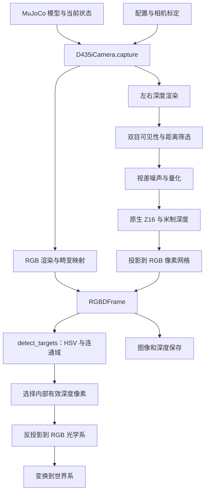

# piper_vision.py 源码说明：从 RGB-D 仿真到 PiPER 目标定位

本文围绕 [`piper_vision.py`](../vision/piper_vision.py) 的当前实现，解释每个类和函数的职责，重点分析 `D435iCamera` 如何生成具有几何约束和测量误差的 RGB-D 数据，以及这些数据如何参与机械臂视觉定位。

阅读时先把握三个结论：

- `D435iCamera` 是 **MuJoCo 中的相机仿真器**，输入为仿真模型和状态，不需要连接 USB 相机。
- 深度由左、右相机的渲染结果经过可见性筛选、视差误差和整数化处理得到；目标标签由独立的 `detect_targets()` 根据颜色生成。
- 最终三维坐标表示目标的一个**可见表面点**。它既不是物体几何中心，也不是已经求解好的抓取位姿。

## 阅读导航

1. [模块在项目中的位置](#1-模块在项目中的位置)
2. [类与函数总览](#2-类与函数总览)
3. [RGBDFrame：数据契约](#3-rgbdframe数据契约)
4. [D435iCamera：逐方法解析](#4-d435icamera逐方法解析)
5. [几何与标定辅助函数](#5-几何与标定辅助函数)
6. [深度对齐的核心细节](#6-深度对齐的核心细节)
7. [颜色检测与三维定位](#7-颜色检测与三维定位)
8. [配置、运行与项目接入](#8-配置运行与项目接入)
9. [实现边界与后续扩展](#9-实现边界与后续扩展)
10. [验证与源码阅读建议](#10-验证与源码阅读建议)

## 1. 模块在项目中的位置

PiPER 项目将相机安装在机械臂末端，属于眼在手上（eye-in-hand）的布置：关节运动和浮动基座运动都会改变相机在世界中的位姿。

| 文件 | 与视觉模块的关系 |
| --- | --- |
| [`xml/parts/d435i.xml`](../../xml/parts/d435i.xml) | 定义相机安装体、RGB/左右深度视点和 IMU site；由机械臂 XML 引入 |
| [`xml/parts/vision_targets.xml`](../../xml/parts/vision_targets.xml) | 定义绿色立方体与蓝色球体，作为颜色检测演示对象 |
| [`config/d435i.py`](../d435i.py) | 提供名义标定、单机标定加载和内部外参应用 |
| [`settings.json`](../settings.json) 的 `vision` 节 | 配置分辨率、帧率、深度窗口、误差参数和 HSV 阈值 |
| [`camera_demo.py`](../../camera_demo.py) | 推进仿真，采集相机与 IMU，显示并保存结果 |
| [`piper_rl_mujoco.py`](../../piper_rl_mujoco.py) | 通过 `PandaObstacleEnv.get_camera_observation()` 向环境调用者提供视觉数据 |
| [`test_vision.py`](../tests/test_vision.py) | 检查相机几何、深度语义、帧率与检测行为 |

模块级常量 `ROOT` 由当前文件向上定位到 `Piper_rl`，供演示程序等定位 XML；它本身不参与图像处理。模块导入 OpenCV、MuJoCo 和 NumPy，不启动 RealSense SDK 数据流。



这里有两层职责：相机层负责“观测到了什么图像和深度”，识别层负责“哪些像素满足目标颜色条件”。`D435iCamera` 不调用 `detect_targets()`，因此可以单独用于深度算法或其他识别方法。

## 2. 类与函数总览

源文件包含 **2 个类、12 个模块级函数**；`D435iCamera` 自定义了 7 个方法。

| 类/函数 | 主要作用 | 主要输入 → 输出 |
| --- | --- | --- |
| `RGBDFrame` | 将图像、深度、标定和时间组织为一帧数据 | 各字段 → 数据对象 |
| `D435iCamera` | 管理标定、渲染器、采样节奏和深度生成流程 | 模型、配置；采集时传入状态 → `RGBDFrame` |
| `load_vision_config(path=None)` | 加载 JSON 并校验 | 配置路径 → 字典 |
| `validate_vision_config(config)` | 检查当前实现支持的流配置和部分参数 | 字典 → 正常返回 `None`，或抛出异常 |
| `camera_matrix(spec, width, height, fov)` | 构造相机内参矩阵 | 标定或视场角 → `3×3` 矩阵 |
| `distortion(spec)` | 读取并检查畸变系数和模型名称 | 标定项 → 长度为 5 的数组 |
| `deproject(depth, k)` | 将无畸变深度图批量反投影 | `H×W` 深度、内参 → `H×W×3` 点阵 |
| `_distort(xy, coeffs, model)` | 在归一化平面应用畸变公式 | 二维归一化坐标 → 畸变坐标 |
| `pixel_rays(pixels, k, coeffs, model=...)` | 从像素求去畸变后的归一化射线坐标 | 像素 → `N×2` 数组 |
| `project(points, k, coeffs=None, model=...)` | 将三维点投影到像素平面 | 三维点 → `N×2` 像素坐标 |
| `align_depth_to_color(...)` | 把深度像素覆盖范围映射到 RGB 网格 | 原生深度、内外参 → 两张对齐深度图 |
| `detect_targets(frame, config=None)` | 颜色分割、连通域筛选与表面点定位 | 帧、配置 → 检测字典列表 |
| `annotate(frame, detections)` | 绘制框、标签和深度文字 | 帧、检测结果 → BGR 图像 |
| `depth_preview(depth, config)` | 将米制深度转为伪彩色预览 | 深度、显示范围 → BGR 图像 |

## 3. RGBDFrame：数据契约

`RGBDFrame` 是 `@dataclass`，由 Python 自动生成初始化等常用方法，没有自定义处理逻辑。它把图像与解释图像所需的内外参一起传递，避免调用者只拿到数组却不知道坐标系和单位。

下表用 `Hc/Wc` 表示 RGB 高/宽，`Hd/Wd` 表示原生深度高/宽。

| 字段 | 形状/类型 | 含义与用途 |
| --- | --- | --- |
| `rgb` | `Hc×Wc×3`，通常 `uint8` | RGB 通道顺序的彩色图像 |
| `native_depth_z16` | `Hd×Wd`，`uint16` | 原生整数深度，0 表示无效 |
| `depth_scale_m` | 浮点数 | 每个整数计数对应的米数 |
| `native_depth_m` | `Hd×Wd`，`float32` | 深度相机光轴上的 Z；无效为 `NaN` |
| `aligned_depth_m` | `Hc×Wc`，`float32` | 映射到 RGB 像素位置的**原始深度相机 Z** |
| `aligned_rgb_z_m` | `Hc×Wc`，`float32` | 同一来源点转换到 RGB 光学系后的 **RGB Z** |
| `rgb_intrinsics` | `3×3` | RGB 内参矩阵 |
| `depth_intrinsics` | `3×3` | 左深度相机内参矩阵 |
| `rgb_distortion` | 长度 5 | RGB 畸变系数 |
| `rgb_distortion_model` | 字符串，默认 `none` | RGB 畸变模型名称 |
| `world_from_optical` | `4×4` | RGB 光学系到世界系的齐次变换 |
| `world_from_depth_optical` | `4×4` | 深度光学系到世界系的齐次变换 |
| `sim_time` | 浮点数，秒 | 实际生成该帧的仿真时间 |
| `calibration_source` | 字符串 | 名义参数或加载标定的来源说明 |

**数组分辨率一致，并不代表数值属于同一个坐标系。** `aligned_depth_m` 和 `aligned_rgb_z_m` 是本模块最容易混淆的字段，第 6 节给出数值例子。

这些字段没有自动类型校验，也没有被设置成只读。`capture()` 可能返回同一个缓存对象，业务代码应将其视为只读；修改图像前使用 `.copy()`。

## 4. D435iCamera：逐方法解析

### 4.1 `__init__(model, config=None)`：建立相机几何与运行状态

初始化按以下顺序组织：

1. 使用传入配置或调用 `load_vision_config()`，并执行 `validate_vision_config()`。
2. 从 `config/d435i.py` 加载标定，通过 `apply_calibration()` 将 RGB、右相机和 IMU 相对深度相机的几何关系写入模型。
3. 找到 RGB、左深度和右相机 ID。前两者由配置指定，右相机名称固定为 `d435i_ir_right`。
4. 为三路视点建立内参；无对应标定时使用名义 FOV。RGB 为 `69°×42°`，左右深度为 `87°×58°`。
5. 设置 MuJoCo 的 `cam_sensorsize`、`cam_resolution`、`cam_intrinsic`，让渲染投影使用这些参数。
6. 读取 RGB 畸变模型；深度和右相机要求畸变系数全为零，即使用已校正的针孔视图。
7. 配置渲染可见组，隐藏 `geomgroup[3]` 和所有 site，并扩大离屏缓冲区以容纳所需分辨率。
8. 调用 `reset()`，准备随机数和帧缓存状态。

`cam_intrinsic` 使用的主点偏移写作 `[(w-1)/2-ppx, ppy-(h-1)/2]`，是在本实现中连接像素主点与 MuJoCo 渲染约定的步骤；不能直接把 `[ppx, ppy]` 原样填入这个位置。

初始化会**修改传入的 `model`**，而非创建独立副本。多个相机实例若共享同一个模型却使用不同标定，会互相影响。渲染器此时仍为 `None`，到首次采集才分配图形资源。

隐藏可视组只影响这次图像渲染，不会删除物体的碰撞或动力学属性。

### 4.2 `reset(seed=None)`：重启采样序列

该方法重新创建 NumPy 随机数生成器，并清除 `_frame`、`_last_request`、`_start`、`_next_time`。

未指定种子时使用配置中的 `seed`；相同种子、相同场景状态和采样顺序可以复现视差噪声序列。只使用相同种子，而改变采样次数或有效像素分布，并不保证得到相同图像。

它不重置 MuJoCo 状态，不重新加载标定，也不销毁已创建的渲染器。重置环境、直接修改 `qpos` 或在同一仿真时间改变场景后，应调用它使下一次采集重新生成图像。

### 4.3 `intrinsics(camera_id)`：提供内参副本

根据相机 ID 返回 `_intrinsics[camera_id].copy()`。返回副本可以防止调用者意外改动内部内参缓存，但修改副本不会修改渲染器参数。

### 4.4 `_pose(data, cid)`：统一到光学坐标系

MuJoCo 相机局部坐标为 X 向右、Y 向上、沿 −Z 观察；本模块输出的光学坐标为 X 向右、Y 向下、Z 向前。因此使用：

$$
C=\operatorname{diag}(1,-1,-1),\qquad
R_{W\leftarrow O}=R_{W\leftarrow M}C
$$

再把 `data.cam_xpos[cid]` 作为平移，构造：

$$
T_{W\leftarrow O}=\begin{bmatrix}R_{W\leftarrow O}&t_W\\0&1\end{bmatrix}
$$

其中 W 为世界系，M 为 MuJoCo 相机局部系，O 为光学系。`C` 的行列式为 +1，等效于绕 X 轴旋转 180°，不会改变右手系性质。

本文统一使用 `target_from_source` 的命名：`world_from_optical` 左乘光学系齐次点，得到世界系点。RealSense 的米制光学坐标同样采用 X 右、Y 下、Z 前约定。[官方坐标说明](https://dev.realsenseai.com/docs/projection-in-realsense-sdk-2-0/)

### 4.5 `_depth(data, camera_id)`：获取理想深度快照

该方法启用深度渲染，更新指定相机视角并返回渲染结果的副本。左右视点共用 `depth_renderer`，先后渲染；`.copy()` 避免后续渲染覆盖前一次结果。

这一步的结果是几何渲染深度，还没有经过双目可见性、噪声和 Z16 处理。按照模块约定，深度表示光轴 Z，单位为米。

### 4.6 `capture(data)`：完整视觉处理流程

#### A. 以仿真时间控制采样

`capture()` 首先读取 `data.time`：若时间小于上次请求时间，自动 `reset()`；若已有帧且尚未到 `_next_time`，直接返回缓存。

设首次实际采集时间为 $t_0$，当前时间为 $t$，帧率为 $f$，下一采样门限为：

$$
t_{next}=t_0+\frac{\lfloor(t-t_0)f+\varepsilon\rfloor+1}{f}
$$

代码通过很小的容差处理浮点边界。固定参照 $t_0$ 计算门限，可以避免每次都从实际采集时间加一个周期造成的累计漂移。

例如默认 25 Hz 下，0 秒采集后，0.002 秒调用会返回原帧；0.04 秒调用会生成新帧，时间戳为 0.04 秒。该函数既不睡眠，也不推进物理仿真。调用间隔过大时只采集当前状态，不补造历史帧。

#### B. 创建渲染器并刷新当前几何状态

首次生成新帧时建立 RGB 和深度两套 `mujoco.Renderer`。随后调用 `mujoco.mj_forward()`，更新当前状态对应的位姿等派生量；这与通过 `mj_step()` 推进时间不同。

三次渲染之间没有物理步进，因此 RGB、左深度和右深度使用同一个仿真时刻的场景。这里没有模拟曝光积分、RGB 逐行曝光或真实设备的传输延迟。

#### C. 渲染 RGB，并按标定加入图像畸变

渲染器先生成针孔图像。如 RGB 畸变系数非零，程序遍历目标像素，经 `pixel_rays()` 求去畸变的归一化坐标，再换算为理想图像中的采样位置，交给 `cv2.remap()` 做双线性插值。

这是逆向图像映射：对“想生成的每个畸变像素”，寻找“应从理想图像哪里取色”。它避免直接向目标图像散点写入时留下大量空隙。映射到图像外的采样点使用 OpenCV 默认边界处理。

#### D. 检查一个左侧表面点是否也能被右侧看到

首先获得左深度 $D_L$ 和右深度 $D_R$。通过 `_pose()` 构造：

$$
T_{R\leftarrow D}=T_{W\leftarrow R}^{-1}T_{W\leftarrow D}
$$

然后依次执行：

1. `deproject()` 将左深度图转换为左光学系三维点。
2. 利用上式把点变换到右光学系。
3. `project()` 得到右图像素，并用 `floor(uv+0.5)` 取整。
4. 排除右图范围外以及位于右相机后方的点。
5. 比较该点的右系 Z 与右图真实渲染表面的深度。

可见性条件为：

$$
\left|D_R(u_R,v_R)-Z_R\right|\leq\tau
$$

其中 $\tau$ 为 `stereo_tolerance_m`，默认 0.01 m。通过检查后，还要求左深度有限且位于配置窗口内。

若左相机看到了某个背景点，但右相机同方向被前景遮挡，右图读到的是前景深度，二者不一致，该点会被剔除。左右视野不重合也会形成无效区域。

**这是一种利用仿真真值的几何可见性检查。** 程序没有读取红外纹理，没有搜索匹配窗口，也没有计算匹配置信度；因此不能把这一过程理解为完整的双目立体匹配。

#### E. 在视差域加入误差

代码令基线 $b=\|t_{R\leftarrow D}\|$，并取左深度相机的水平焦距 $f_x$。对已通过筛选的深度计算：

$$
d=\frac{f_xb}{Z},\qquad
d_n=d+\epsilon,\quad \epsilon\sim\mathcal N(0,\sigma_d^2)
$$

若 `disparity_step_px` 为正，再执行：

$$
d_q=s\operatorname{round}(d_n/s),\qquad Z_n=\frac{f_xb}{d_q}
$$

其中 $s$ 是视差步长；设为 0 时跳过视差量化。非正视差不能形成有效深度。

为什么把噪声加在视差上？在平行、校正的双目近似下，距离来自视差的倒数。对 $Z=f_xb/d$ 求导可得：

$$
\sigma_Z\approx\left|\frac{\partial Z}{\partial d}\right|\sigma_d
=\frac{Z^2}{f_xb}\sigma_d
$$

因此，相同像素级视差误差对远距离深度的影响更大。按默认 848 像素宽、87° 水平 FOV、50 mm 名义基线估算，$f_x\approx447$ px，$f_xb\approx22.3$ px·m；取 $\sigma_d=0.08$ px，1 m 和 2 m 处的一阶深度标准差约为 3.6 mm 和 14.3 mm。

这些数值是根据**本项目配置推导的模型行为**，不是设备精度保证，也没有计入后续量化、裁剪和遮挡影响。对于非平行或非水平基线标定，程序的可见性变换仍使用完整外参，但这条标量视差误差公式仍然只是近似。

#### F. 量化为 Z16，并统一无效值表示

取标定中的深度单位 $q=\texttt{depth\_scale\_m}$，计算：

$$
n=\operatorname{round}(Z_n/q),\qquad Z_{stored}=nq
$$

只有深度仍在配置窗口内、计数有限且满足 $1\leq n\leq65535$ 的点才写入 `uint16` 图像。其余位置保持为 0。

默认 $q=0.001$ m，例如 1234 表示 1.234 m。代码随后通过 `z16.astype(np.float32) * depth_scale` 得到 `native_depth_m`，把零计数转成 `NaN`。整数值乘深度比例得到米制值、零值代表无效，也是 RealSense Z16 的基本语义。[官方深度格式说明](https://dev.realsenseai.com/docs/projection-in-realsense-sdk-2-0/)

这里存在两次离散化：视差步长对应距离相关的深度间隔；Z16 单位对应固定米制间隔。因此，“按毫米存储”不等于“测量误差只有一毫米”。

#### G. 对齐到 RGB，打包并缓存

构造深度到 RGB 的变换：

$$
T_{C\leftarrow D}=T_{W\leftarrow C}^{-1}T_{W\leftarrow D}
$$

将量化后的原生深度交给 `align_depth_to_color()`，获得两张 RGB 分辨率的深度图，再连同 RGB、内外参、实际时间和标定来源创建 `RGBDFrame`，更新采样门限。

关键顺序是**先生成有无效值和测量误差的原生深度，再对齐**。因此，对齐结果保留了上游深度的缺失和误差来源。

### 4.7 `close()`：释放离屏渲染资源

分别关闭两个已存在的 renderer，并清空渲染器引用和帧缓存。通过 `try/finally` 调用，可以在采集或保存出错时也释放图形资源。

`close()` 不负责关闭 GUI 窗口或 MuJoCo viewer；这些由 `camera_demo.py` 等调用者管理。若要开始新的采样序列，应显式调用 `reset()`，不要把资源释放与时间状态重置混为一谈。

## 5. 几何与标定辅助函数

### 5.1 `load_vision_config()` 与 `validate_vision_config()`

`load_vision_config(value=None)` 从统一 `config/settings.json` 读取 `vision` 节，支持统一 JSON 路径或节字典递归覆盖，再调用 `validate_vision_config()`；路径按项目根目录解释。

`validate_vision_config()` 限制 RGB 为 1280×720 或 1920×1080，深度为 848×480 或 1280×720，仿真采集帧率为 6、15、25 或 30 Hz（默认 25 Hz，不代表硬件原生流配置）。深度宽 848 时 `min_depth_m` 至少为 0.168 m；宽 1280 时至少为 0.28 m，且最小深度小于最大深度。三个误差参数必须有限且非负。

这些是**当前仿真实现的支持范围**。函数没有完整检查所有字段类型、HSV 阈值或 `min_area_px`，也不负责检查相机名称是否存在；缺少必要键等问题可能由后续代码直接抛出异常。

### 5.2 `camera_matrix()`：像素与归一化平面的桥梁

针孔内参为：

$$
K=\begin{bmatrix}f_x&0&c_x\\0&f_y&c_y\\0&0&1\end{bmatrix}
$$

无标定时，根据水平与垂直 FOV 分别计算：

$$
f_x=\frac{W}{2\tan(\theta_x/2)},\quad
f_y=\frac{H}{2\tan(\theta_y/2)},\quad
c_x=\frac{W-1}{2},\quad c_y=\frac{H-1}{2}
$$

有标定时使用 `fx/fy/ppx/ppy`，要求标定分辨率与请求分辨率完全一致，矩阵元素有限且焦距为正。代码不会自动缩放标定内参，也不假设 `fx == fy`。

这里的名义 FOV 是缺少单机标定时的几何近似。替换分辨率、裁剪图像或加载真实标定时，都应保持图像与内参一致。

### 5.3 `distortion()` 与 `_distort()`：表达镜头畸变

`distortion()` 返回顺序为 `[k1, k2, p1, p2, k3]` 的五个系数，检查长度、有限性及模型名。无标定返回全零；允许 `none` 和三种 Brown-Conrady 名称，带前缀的模型字符串通过最后一个 `.` 后的部分识别。

对于标准 Brown-Conrady，令归一化坐标为 $(x,y)$：

$$
r^2=x^2+y^2,\qquad a=1+k_1r^2+k_2r^4+k_3r^6
$$

$$
x_d=xa+2p_1xy+p_2(r^2+2x^2)
$$

$$
y_d=ya+2p_2xy+p_1(r^2+2y^2)
$$

径向项控制随离主点距离变化的畸变，切向项表达非理想对准带来的偏移。`_distort()` 对 `modified_brown_conrady` 和 `inverse_brown_conrady` 走同一分支：先将局部 `x/y` 换为径向缩放结果，再计算切向项，`r2` 保持原值。

这是对**当前代码公式**的描述，不意味着各种模型在所有 SDK 投影/反投影 API 中可以任意互换。本模块用统一的数值求逆来与自己的前向函数配对；实际设备标定的模型语义仍需匹配。

### 5.4 `pixel_rays()`：从像素找回空间方向

函数先通过内参归一化像素，得到目标坐标 $q_d$。若存在有效畸变，令初值 $q_0=q_d$，迭代：

$$
q_{i+1}=q_i+\left(q_d-\operatorname{distort}(q_i)\right)
$$

最多 30 次，迭代误差小于 `1e-10` 提前退出；结果非有限或最终残差大于 `1e-6` 时抛出 `ValueError`。这是固定点式残差修正，不是使用雅可比矩阵的牛顿法，强畸变下不保证收敛。

返回值是 `N×2` 的 $(x_n,y_n)$。它**不是单位长度三维向量**，对应的光线方向写作 $(x_n,y_n,1)$。由于深度是 Z，反投影直接乘 Z；若先把该方向归一化再乘 Z，会改变深度语义。

### 5.5 `deproject()` 与 `project()`：正反投影

无畸变深度图的反投影公式为：

$$
X=\frac{u-c_x}{f_x}Z,\qquad
Y=\frac{v-c_y}{f_y}Z,\qquad
P=(X,Y,Z)
$$

`deproject()` 通过 `np.indices()` 和数组运算一次性处理整张深度图，保留 `H×W` 的像素对应关系。它不处理镜头畸变，也不主动过滤无效值；这是深度/右视图必须校正的重要原因。

`project()` 则把输入整理成 `N×3`，计算 $(X/Z,Y/Z)$，按需调用 `_distort()`，最后乘焦距、加主点，输出浮点像素。它不保证点在相机前方或图像范围内，这些检查由调用者执行。

例如 $f_x=f_y=600$、$(c_x,c_y)=(320,240)$，像素 $(380,270)$ 的 Z 为 1 m，则三维点为 $(0.10,0.05,1.00)$ m。点到光心的欧氏距离约为 1.006 m，与 Z 不相等。

## 6. 深度对齐的核心细节

`align_depth_to_color()` 解决的是不同相机间的对应关系。由于 RGB 与深度的分辨率、视场、光心和可能的朝向不同，单纯缩放深度图不能得到正确对齐。

### 6.1 从一个深度像素到 RGB 覆盖区域

输入包括原生深度、两路内参、`color_from_depth`、RGB 图像形状，以及 RGB 畸变参数。处理步骤为：

1. 取出有限且大于 0 的深度像素。
2. 对每个像素的四个角 $(u\pm0.5,v\pm0.5)$，使用同一深度值反投影。
3. 将四角三维点变换到 RGB 光学系，并投影到 RGB 图像。
4. 对投影四角求轴对齐包围矩形，再取整得到覆盖范围。
5. 同时变换像素中心，得到该来源点的 RGB Z。
6. 对覆盖范围内的 RGB 像素写入深度；多个来源竞争时保留更小的原生 Z，并同步保存该来源的 RGB Z。

把一个来源像素扩展到一个覆盖区域，通常称为 splatting。它在分辨率不同的情况下比“每个来源点只填一个目标像素”更容易形成连续覆盖，但属于离散近似：这里填的是包围矩形，不是精确多边形，也不是逐目标像素重新求表面交点。

SDK 对齐代码也采用来源像素覆盖和来源深度竞争的处理思路；本实现的四角包围矩形等细节应以本地代码为准，不应假定与 SDK 逐像素完全一致。[librealsense 对齐源码](https://github.com/realsenseai/librealsense/blob/master/src/proc/align.cpp)

### 6.2 为什么同时返回两种 Z

设深度光学系点为 $P_D$，变换后 $P_C=R_{C\leftarrow D}P_D+t_{C\leftarrow D}$：

$$
Z_D=(P_D)_z,\qquad Z_C=(P_C)_z
$$

输出中的 `aligned_depth_m` 保存 $Z_D$，`aligned_rgb_z_m` 保存 $Z_C$。

例如只有沿 Z 的 0.1 m 平移，某点 $Z_D=1.0$ m，则 $Z_C=1.1$ m。两张图在相同 RGB 像素上分别保存 1.0 和 1.1。用 RGB 内参恢复三维点时必须使用 1.1，否则会错误地缩放整条射线。

在当前名义标定的平行光轴、仅横向平移条件下，两者可以相等；接口分别保留它们，是为了在改变外参后仍保持语义正确。

### 6.3 无效区域、冲突与边界行为

没有来源像素覆盖的位置最终为 `NaN`，函数没有专门的补洞或时间滤波步骤。像素覆盖会填充来源足迹内部的多个位置，但不能凭空恢复未被双目观测到的表面。

实现还有几个具体约束：

- 若像素中心转换后的 RGB Z 不为正，舍弃该来源。
- 覆盖矩形必须完全位于 RGB 图像内；越界时整体舍弃，而非裁剪后保留一部分。
- 任何覆盖矩形的宽或高超过 32 像素，就抛出异常，防止异常标定导致过大的填充开销。
- 冲突判断使用原生 $Z_D$ 的最小值；一般外参下，它不保证等同于按 RGB $Z_C$ 排序。

源码注释中写有“far-to-near”，实际 `np.argsort(values)` 按升序排列，再取重复目标索引的首个候选并与已存值比较。理解行为时应以**保留最小来源深度**这一实际逻辑为准。

## 7. 颜色检测与三维定位

### 7.1 `detect_targets()`：从颜色连通域选择表面点

该函数只使用帧数据和配置；不会读取目标 body 的位置、geom ID 或场景标签来决定识别结果。世界坐标变换来自帧中的仿真外参，因此“识别未使用物体真值”与“世界定位使用相机真值”需要分别理解。

处理链如下：

1. **RGB → HSV。** 使用 `cv2.COLOR_RGB2HSV`；对常见 8 位输入，OpenCV H 通道范围为 0～179，S/V 为 0～255。配置不能直接填入 0～360 的色相角度。
2. **颜色阈值。** 对每个目标用 `cv2.inRange()` 生成二值掩码。默认将绿色区间命名为 `green_cube`，蓝色区间命名为 `blue_sphere`。
3. **开运算。** 使用 `3×3` 全一核先腐蚀再膨胀，去除小亮噪点；细小目标也可能被削弱或移除。开运算的定义及作用参见 [OpenCV 形态学说明](https://docs.opencv.org/4.x/d9/d61/tutorial_py_morphological_ops.html)。
4. **连通域分析。** `connectedComponentsWithStats()` 提取区域面积、包围框和像素质心，跳过背景及面积小于 `min_area_px` 的区域。
5. **收缩区域边界。** 对该连通域再腐蚀一次，降低目标边缘混入背景深度的机会。
6. **寻找有效深度像素。** 将内部区域与 `aligned_depth_m` 的有限值、深度窗口条件取交集。
7. **选择代表点。** 在剩余像素中选择距离二维质心最近的像素，而不是直接读取四舍五入后的质心位置。
8. **恢复三维。** 读取该像素的 `aligned_rgb_z_m`，经 `pixel_rays()` 去畸变并反投影，再用 `world_from_optical` 转到世界系。

代码不是取区域平均深度或中位数，而是选取**单个内部有效像素**。这样做保留了像素与表面点的明确对应，但结果仍会受到单点噪声影响。

为何不直接用二维质心？质心是区域像素坐标的平均值，可能落在凹形区域外、遮挡孔洞或深度缺失处。约束“区域内部且深度有效”可以减少这些情况。

这里的有效性筛选用来源 Z，最终反投影用 RGB Z。调用者若自行构造或修改 `RGBDFrame`，必须维持两张对齐图有效位置的一致性；检测函数没有再次独立校验 `aligned_rgb_z_m`。

### 7.2 检测结果的字段

| 字段 | 含义 |
| --- | --- |
| `label` | 配置中的标签，不是形状分类网络的输出 |
| `bbox_xywh` | 连通域包围框左上角与宽高，单位像素 |
| `center_uv` | 连通域二维质心，可为小数 |
| `area_px` | 开运算后该连通域的像素面积，不是物体真实表面积 |
| `depth_pixel_uv` | 实际用于深度读取的整数像素，可能不同于质心 |
| `depth_m` | 所选点在 RGB 光学系中的 Z，单位米 |
| `surface_point_optical_m` | 所选表面点在 RGB 光学系中的 XYZ |
| `surface_point_world_m` | 同一点在世界系中的 XYZ |

如果没有内部有效深度，仍然返回二维检测，后四个字段为 `None`；JSON 中会表现为 `null`。没有检测到物体，与检测到物体但无法测距，是两个不同状态。

每个目标颜色可能产生多个连通域，因此同一标签可重复出现。函数没有跨帧跟踪 ID，没有置信度输出，也不会根据轮廓验证对象是否真的为立方体或球体；同色物体粘连时也可能合并为一个区域。

### 7.3 `annotate()` 与 `depth_preview()`

`annotate()` 将 RGB 转成 OpenCV 显示/保存常用的 BGR，再绘制黄色矩形和“标签 + 三位小数深度”；深度缺失时显示 `depth invalid`。它不改变检测结果或原始 RGB 数组，也不绘制完整三维坐标。

`depth_preview()` 按配置窗口对深度线性归一化，裁剪到 `[0,1]`，转换成 8 位后应用 TURBO 色图；非有限深度涂黑。有限但超出窗口的数值会饱和到色图端点，不能仅凭颜色判断其原始数值。预览图只用于观察，应使用 `.npy` 米制数组做测量。

## 8. 配置、运行与项目接入

### 8.1 默认参数与效果

| 参数 | 默认值 | 对处理流程的影响 |
| --- | --- | --- |
| `rgb_camera` / `depth_camera` | `d435i_rgb` / `d435i_depth` | 在模型中选择对应视点 |
| `width` / `height` | 1280 / 720 | RGB 渲染和对齐结果尺寸 |
| `depth_width` / `depth_height` | 848 / 480 | 左右深度渲染尺寸 |
| `fps` | 30 | 控制新帧生成门限，依据仿真时间 |
| `min_depth_m` / `max_depth_m` | 0.168 / 3.0 m | 原生深度筛选、检测筛选和预览范围 |
| `calibration_path` | `null` | 使用名义标定；指定路径后加载 JSON |
| `disparity_noise_std_px` | 0.08 px | 视差高斯噪声强度 |
| `disparity_step_px` | 0.03125 px | 视差离散步长，等于 1/32 px |
| `stereo_tolerance_m` | 0.01 m | 左点投到右图后的 Z 一致性阈值 |
| `seed` | 0 | 随机噪声种子 |
| `min_area_px` | 80 | 过滤小颜色连通域 |
| `targets` | 绿色立方体、蓝色球体 | 指定标签及 HSV 上下界 |

增大可见性容差会放宽遮挡判断，但可能接纳错误对应；减小容差会更严格，也可能因为取整和表面深度变化剔除更多点。`max_depth_m=3.0` 是应用裁剪选择，不是完整硬件量程声明。

`depth_scale_m`、两相机之间的内部外参和可选内参位于标定数据中，不是这份视觉配置中的顶层字段。`calibration_path` 为相对路径时，以进程工作目录为基准。

### 8.2 最小使用示例

在 `Piper_rl` 目录中运行，下例假定已安装项目依赖并可使用 EGL：

```python
import os

# 必须在导入 mujoco 或 piper_vision 之前选择渲染后端。
os.environ.setdefault("MUJOCO_GL", "egl")

import mujoco
from config.vision.piper_vision import D435iCamera, ROOT, detect_targets

model = mujoco.MjModel.from_xml_path(str(ROOT / "xml/agilex/scene.xml"))
data = mujoco.MjData(model)
mujoco.mj_resetDataKeyframe(model, data, model.key("home").id)

camera = D435iCamera(model)
try:
    frame = camera.capture(data)
    detections = detect_targets(frame, camera.config)
    print("采集时刻：", frame.sim_time)
    for item in detections:
        print(item["label"], item["surface_point_world_m"])
finally:
    camera.close()
```

该示例只采集当前状态。连续观测时需要调用者推进仿真，并根据 `frame.sim_time` 判断是否产生了新帧。

使用完整演示程序：

```bash
python camera_demo.py --headless --frames 30
```

默认输出目录为 `config/outputs/vision/`。程序在采集循环结束后保存**最后一帧**的 RGB、标注图、深度预览、四份深度数组及 `detections.json`；`imu.jsonl` 保存循环中累计的 IMU 样本。`--frames 30` 不代表自动保存 30 套图像。

### 8.3 在机械臂环境中的意义

`PandaObstacleEnv.get_camera_observation()` 延迟创建相机，然后返回 `(frame, detections)`；环境 `reset()` 同步重置相机采样状态，`close()` 释放相机资源。

当前 PPO 观测仍由 **6 个关节角和 3 个目标位置分量**构成。调用视觉接口不会自动修改策略输入，演示用颜色物体也不会自动替换环境中的任务目标。

从相机点到机器人任务坐标需要明确变换链。若记 B 为基座、E 为末端、C 为 RGB 光学系，则眼在手上的定位关系可写为：

$$
P_W=T_{W\leftarrow B}\,T_{B\leftarrow E}(q)\,T_{E\leftarrow C}\,P_C
$$

仿真通过 `data.cam_xmat/cam_xpos` 直接提供组合后的相机世界位姿。实机对应项来自基座定位、机器人运动学和手眼标定；`apply_calibration()` 只应用设备内部几何，不会求解末端到相机的安装变换。

若控制目标采用基座系，可用 $P_B=T_{W\leftarrow B}^{-1}P_W$ 转换。基座运动时，这个变换应与帧的采集时刻对应，避免把旧图像与新位姿混用。

## 9. 实现边界与后续扩展

### 9.1 已实现到什么程度

| 能力 | 当前实现 | 对项目使用的含义 |
| --- | --- | --- |
| 成像几何 | 独立内参、内部外参、RGB 畸变映射 | 可研究投影误差及标定对定位的影响 |
| 深度可见性 | 由左右渲染深度做几何一致性判断 | 有视野缺失和遮挡孔洞 |
| 深度误差 | 高斯视差噪声、视差量化、Z16 量化 | 可研究测距误差随距离变化 |
| 深度对齐 | 像素足迹投影，保存来源 Z 与 RGB Z | 可把彩色区域关联到三维点 |
| 识别 | HSV 阈值、连通域和单表面点 | 适用于颜色有区分度的演示场景 |
| 时间 | 仿真时间门控、旧帧保持 | 高频控制循环可能多次读取同一帧 |
| IMU | 由独立模块采样 | 本文件没有视觉惯性融合或位姿估计 |

红外散斑、低纹理匹配失败、材质导致的深度异常、曝光与运动模糊、逐行曝光、丢帧和传输延迟均没有在本文件中完整建模。颜色检测也会受光照、背景颜色和遮挡影响。

### 9.2 可围绕 PiPER 继续开展的工作

以下属于扩展方向，不是当前代码已经提供的功能。

| 目标 | 可以从哪里扩展 | 需要关注的问题 |
| --- | --- | --- |
| 降低定位抖动 | 在目标内部采样多个有效三维点，做稳健估计 | 曲面上直接平均可能不再得到真实表面点 |
| 从表面点走向抓取位姿 | 结合目标点云拟合平面/几何体，估计法向和姿态 | 还需夹爪约束、碰撞检测与可达性判断 |
| 替换颜色规则 | 保留帧接口，将检测层换成实例分割或其他方法 | 框内可能含背景，需保持像素级深度关联 |
| 接入视觉策略 | 重新定义环境观测、缺失标志和帧龄信息 | 缓存帧不能当作每个物理步的新测量 |
| 适配真实相机 | 将采集层替换为 SDK 后端，维持字段语义 | 内参、畸变、深度 Z、时间戳和手眼标定必须一致 |
| 提升仿真速度 | 缓存像素网格及固定标定的畸变 remap | 当前每帧重新生成网格、迭代和排序；修改前应先测量耗时 |

对实机迁移尤其有价值的是保留明确的数据契约：二维检测是否存在、深度是否有效、坐标属于哪个参考系、图像何时采集，都应由接口表达，不能由调用者猜测。

## 10. 验证与源码阅读建议

[`test_vision.py`](../tests/test_vision.py) 已编写以下类别的检查：RGB/深度尺寸、目标表面位置、相机安装与运动、名义 FOV、Z16 和无效带、帧率缓存、两种对齐 Z、畸变投影往返、非法配置、目标隐藏及无效深度下的二维检测保留。

在配置好依赖和 EGL 的 `Piper_rl` 目录中，可运行：

```bash
python -m unittest discover -s config/tests -p 'test_vision.py' -v
```

这些测试使用实际离屏渲染，但不构成真实设备精度验证。本文按源码解释其检查意图，不声称本次编写文档已执行并通过测试。当前安装测试中还保留了位置断言 `[0, -0.065, 0.035]`，与当前 XML 的 `d435i_mount` 位置 `[-0.047, 0, 0.065]` 不一致；若检查安装几何，应先对照当前模型确认预期，不能把历史断言当作现状。

建议按以下顺序阅读源码：先看 `RGBDFrame` 了解输出，再顺着 `capture()` 的数据流阅读 `deproject()`、`project()` 与对齐函数，最后阅读 `detect_targets()`。运行与标定导出方法可结合现有的 [D435i 视觉使用说明](d435i_vision.md)；几何和硬件建模背景可参见 [硬件审查说明](d435i_hardware_audit.md)，并以当前代码与 XML 为实现依据。
